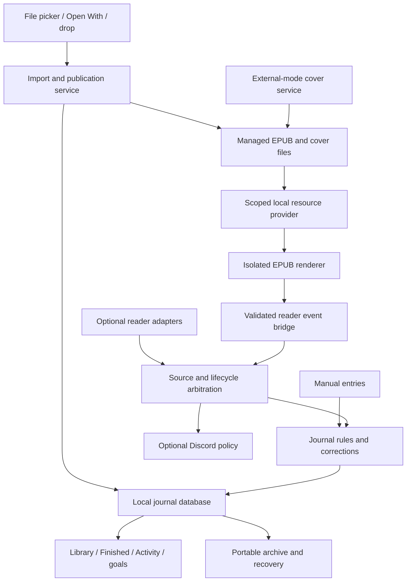

# Stillleaf: full offline reader product and implementation plan

Planning snapshot: September 24, 2026. Status: recommendation for review, not implementation authorization or a delivery commitment. This document extends `OFFLINE_EPUB_READER_DECISION_2026-09-24_01a0d6c6.md`; its broader parity roadmap and stricter cover policy take precedence over that earlier brief.

## Executive recommendation

Build Stillleaf into a polished, offline EPUB reader and personal reading journal for **Mac and Windows together**, with iOS/iPadOS and Android following the same product/data model. A user should be able to double-click an EPUB, read comfortably, customize its appearance, annotate it, and find it later in a beautiful library and finished-books timeline. Tracking, goals, ratings and private reviews should feel built into reading. Apple Books observation remains optional; Discord belongs in secondary integrations.

Preserve the native Mac shell and mature Swift history engine. Reuse a shared web reading component across Mac WKWebView and a productionized Windows Electron application derived from the isolated prototype. Evaluate Readium Web first against epub.js before fixing the engine. This choice preserves current work while funding Windows as a real product, with Windows hardware testing from the first milestone. Share publication, locator, theme and event contracts; avoid a wholesale UI/core rewrite before the rendering and portability gates pass.

The target is **quality parity for everyday local EPUB reading, plus stronger customization and journaling**. It is larger than an import-and-page-turn MVP. All identified Apple Books features are accounted for below: included, staged, or explicitly outside the offline EPUB scope pending a decision. Apple storefront, purchase entitlements and proprietary DRM cannot be promised. Audiobook/PDF/media features are named extensions, not silently treated as EPUB parity.

Core operation needs no account, online catalog, hosted service, or mandatory synchronization. Imported EPUB covers come from the EPUB itself, with an explicit local cover override or local placeholder when necessary. Online cover lookup is confined to external-reader tracking and never becomes a fallback while reading inside Stillleaf. Backup/transfer is local first; cloud sync remains a separate product choice.

## 1. Evidence, baseline and meaning of parity

**Evidence:** inspected current Mac package/models/store/tracking orchestration and cover/Discord code, the separate Windows Electron source, and its verification report. Mac HEAD during this pass was `2f1f9c690b9ba80fca984d0c08cd6b6a86dede9f`; active tasks may move it. Official Apple guides, Readium/epub.js documentation/licenses, Microsoft deployment documentation and Discord asset documentation were retrieved during planning. No live Apple Books feature comparison or Windows/mobile runtime evaluation was performed here.

Apple's version-neutral documentation redirects and search results vary in version and locale. The reference baseline is the explicitly versioned **Books 8 / macOS Tahoe 26 guide**, supplemented by retrieved iPhone/iPad guides. Newer or version-sensitive behavior such as Line Guide must be recorded against actual device versions in milestone M0. Published support is evidence of intended behavior, not proof of behavior in every edition or document.

**Timeline evidence and settled product direction:** Apple explicitly calls its Finished collection a timeline and permits editing finish dates. Its separate goals UI presents minutes, streaks and yearly completions. The user has now specified Stillleaf's arrangement: Library and Timeline are separate primary destinations; Timeline is a spacious vertical chronology with large prominent dates and visible ratings, without a redundant Recent sorter. Preserve useful session/calendar history through secondary activity detail, not a Library timeline toggle or a diagnostic queue in the primary Timeline. Do not claim Apple exposes Stillleaf-style audited intervals. [Apple Finished collections](https://support.apple.com/en-asia/guide/books/ibks33867842/mac), [Mac goals](https://support.apple.com/en-ng/guide/books/ibks7c41beea/mac), [iPhone goals](https://support.apple.com/en-euro/guide/iphone/iph6013e96f4/ios).

**Definition of done:** a feature is at parity only when its complete workflow passes on both supported desktop platforms, including keyboard/screen-reader use, persistence, offline behavior and recovery. Similar screenshots or an engine checkbox are insufficient. M2 is a usable reader alpha; M5 is the proposed desktop parity release. Until M5 passes, describe exactly what works rather than advertising “all Apple Books features.”

## 2. Explicit parity and scope matrix

Milestones M0–M7 are specified in section 12. “Both” means Mac and Windows. Mobile ports inherit the accepted desktop behavior, with touch adaptations in M6. Apple columns summarize documentation, not an exhaustive reverse engineering claim.

| Capability | Verified Apple reference / qualification | Stillleaf target and gate |
|---|---|---|
| Import/open EPUB | Mac imports many EPUBs via File > Import or drag/drop; some vendor formats require their own apps. [Import](https://support.apple.com/en-bh/guide/books/ibkseed72068/mac) | Both: picker, batch drop, OS Open With, double-click when user-selected default; managed local copy, duplicates and clear failures. M2. |
| Resume / Continue | Mac Home exposes current reading; opening resumes reading context. [Reading](https://support.apple.com/guide/books/read-books-ibks5f526382/8.0/mac/26) | Resume tile and durable per-edition locator; same book opens without duplicate import. Both M2. |
| Navigation | Mac documents TOC, keyboard/gesture page changes, search and back/return after jumps. [Reading](https://support.apple.com/guide/books/read-books-ibks5f526382/8.0/mac/26) | TOC, landmarks/page-list where present, chapter picker, location slider, history stack, footnote return, accurate RTL direction. M2, polish M4. |
| Bookmarks | Multiple bookmarks and navigation to them. [Reading](https://support.apple.com/guide/books/read-books-ibks5f526382/8.0/mac/26) | Add/remove/name, bookmark list and stable restore after reflow. M2. |
| Typography/layout | Mac offers fonts, size, themes, bold, spacing, justification, columns and hyphenation. [Appearance](https://support.apple.com/guide/books/change-a-books-appearance-ibks8923126d/8.0/mac/26) | Match these controls in a good default reader, then named profiles, explicit widths, colors, scoped overrides and portable settings. M2 basic; M4 complete. |
| Scroll/animation/touch | iPhone/iPad document scroll, curl/fade, themes and touch navigation; iPad also exposes column choice. [iPhone](https://support.apple.com/guide/iphone/read-books-iphc1af7c57/ios), [iPad](https://support.apple.com/guide/ipad/read-books-ipadc8494b6b/ipados) | Paginated/continuous reading on both desktops. Instant/fade first; optional curl only after selection/performance tests. M4; touch parity M6. |
| Highlights/notes | Color/underline, notes, lists and editing are documented; support varies by book type. [Mac annotation](https://support.apple.com/en-ie/guide/books/ibks3975f128/mac), [phone annotation](https://support.apple.com/guide/iphone/annotate-books-iph17bf340c1/27/ios/27) | Stable range annotations, palette, note editing/deletion, sidebar jump, search and local export; no silent orphan deletion. M3. |
| In-book search | Mac searches words, phrases or page references. [Reading](https://support.apple.com/guide/books/read-books-ibks5f526382/8.0/mac/26) | Incremental local text search, snippets, next/previous, cancel; distinguish real page labels from generated locations. M3. |
| Library/search | Apple supports collections and grid/list/sort options. [Mac collections](https://support.apple.com/en-asia/guide/books/ibkse71c34db/mac), [phone organization](https://support.apple.com/en-euro/guide/iphone/iphab219b91/ios) | Separate primary bookshelf containing all configured/imported/downloaded books, including external-only records; cover grid/list, search, useful title/author/manual ordering, collections, multi-select, edition-aware duplicates and editable metadata. No Library timeline toggle. M3. |
| Finished timeline | Apple shows completed titles and dates; manual completion and date edits exist. [Finished](https://support.apple.com/en-asia/guide/books/ibks33867842/mac) | Separate primary Timeline: spacious vertical chronology, large prominent dates, covers, visible ratings, review links and reread episodes. No redundant Recent sorter. Backdating does not invent sessions. M3. |
| Activity history | Goals and streaks are documented; no equivalent detailed audit timeline established here. [Goals](https://support.apple.com/en-ng/guide/books/ibks7c41beea/mac) | Preserve useful day/week/month/year and per-book activity detail secondarily. Tracking corrections belong in Troubleshooting/contextual actions; suppress empty automatic zero-page fragments from Timeline and personal-review surfaces. M3. |
| Daily/yearly goals | Apple documents minutes/day and books/year. [Phone goals](https://support.apple.com/en-euro/guide/iphone/iph6013e96f4/ios) | Integrate main task's daily pages/minutes selection and yearly books goal; honest source/units, no layout-generated inflation. M3. |
| Ratings/reviews | Apple's Mac guide covers storefront ratings/reviews. [Reviews](https://support.apple.com/guide/books/rate-and-review-books-and-audiobooks-ibks7c0a2e26/8.0/mac/26) | Primary Reviews means personal written book reviews, with private quarter-star ratings and optional text for any book. Never use it for diagnostic session validation. Integrate current task. M3; public posting out of scope. |
| Covers | Product-specific requirement; Apple network behavior is not inferred | Built-in: embedded EPUB cover/local override/placeholder only. External tracking: reuse local cover or optional online matching/cache. Separate Discord artwork. M2–M3. |
| Accessibility | Apple documents appearance accessibility controls and version-sensitive mobile Line Guide. [Appearance](https://support.apple.com/en-tj/guide/books/ibks8923126d/mac), [phone reader](https://support.apple.com/guide/iphone/read-books-iphc1af7c57/27/ios/27) | VoiceOver/NVDA/Narrator, semantic navigation, high contrast, large text, focus, reduced motion; optional line guide. Tested from M0, release gate M5; TalkBack M6. |
| Lookup/glossary | Mac supports Look Up and glossaries in suitable interactive books. [Definitions](https://support.apple.com/guide/books/see-book-glossaries-and-definitions-ibkse4722c53/8.0/mac/26) | Book glossary navigation plus local dictionary interface on both. Dictionary dataset/license and installed language availability are M0 decisions; finish M4. |
| Speech/translation | Mac documents system speech, book-provided read-aloud and selection translation. [Reading](https://support.apple.com/guide/books/read-books-ibks5f526382/8.0/mac/26) | Local installed-voice TTS and selection copy/share M4. Download-free first-run voices cannot be assumed. Translation/language packs and synchronized media overlays are explicit M7 extensions. |
| Study cards | Apple documents study cards for supported books. [Study cards](https://support.apple.com/guide/books/use-study-cards-ibks836b154c/8.0/mac/26) | Optional local cards from own notes/glossary M7; keep in parity ledger, not an unmentioned omission. |
| Fixed layout/complex EPUB | Apple supports richer books, with feature-dependent behavior. [Interactive content](https://support.apple.com/guide/books/interact-with-video-audio-and-more-ibksda067bed/8.0/mac/26) | Reflow EPUB first, fixed-layout spreads/zoom and complex text corpus by M4. Scripted widgets, media-overlay synchronization and proprietary book formats M7/unsupported as appropriate. |
| PDFs | Mac import guide says PDFs open in Preview/default reader. [Import](https://support.apple.com/en-bh/guide/books/ibkseed72068/mac) | External-open/manual tracking is acceptable Mac parity; integrated PDF reader is separate M7 scope, not promised by EPUB support. |
| Audiobooks | Apple imports some audio and provides an audiobook product. [Import](https://support.apple.com/en-bh/guide/books/ibkseed72068/mac) | Manual listening records can fit journal; local audiobook playback, chapters/speed/sleep timer/background audio M7. No Audible/proprietary DRM promise. |
| Sharing/notifications | Apple has share and goal notification workflows. [Goals](https://support.apple.com/en-ng/guide/books/ibks7c41beea/mac), [phone annotations](https://support.apple.com/guide/iphone/annotate-books-iph17bf340c1/27/ios/27) | User-initiated clipboard/export/OS share; optional local reminders and subtle completion motion. No mandatory notification setup. M3–M4. |
| Sync/portability | Apple uses account/iCloud synchronization for progress and library-related data. [Settings](https://support.apple.com/en-ie/guide/books/ibksa12a5a23/mac) | Versioned portable local archive, books optional, import/conflict preview on both M3. Live cloud sync is not equivalent and is not included; separate future decision. |
| Store/recommendations/purchases | Apple's product includes store, recommendations, purchases and account services. [Overview](https://support.apple.com/en-tm/guide/books/abd656cd9034/mac) | Not applicable to requested offline core. No store, hosted recommendations, Family Sharing or Apple purchase entitlement replication. Label this scope boundary explicitly. |
| DRM/borrowing | Vendor-protected formats and licenses are not generally interchangeable. [Apple import limits](https://support.apple.com/en-bh/guide/books/ibkseed72068/mac) | DRM-free EPUB target; font obfuscation handled separately. Protected titles remain in their reader with optional tracker support. LCP is a later licensed integration, not base-engine parity. |
| External tracking/Discord | Stillleaf capability rather than Apple reader parity | Preserve Mac observer, manual reading and exclusions. Windows adapter capabilities verified individually. Discord optional, secondary, never required to read or obtain a local cover. M3/M5. |

The baseline release includes M2–M5 rows, not merely the M2 alpha. M7 and ecosystem exclusions must be visible in release scope; calling this “all features” without these qualifications would be inaccurate. Further Apple workflows discovered in hands-on comparison become named ledger rows, not assumed support.

## 3. Product structure and complete user flows

Keep the sea-glass visual direction for the application shell, with comfortable neutral reading surfaces. Primary navigation: **Read, Library, Timeline, Reviews**. Library is the bookshelf for all configured/imported/downloaded titles, including external-only records; distinguish availability with a quiet badge rather than hiding such books. Timeline is its own spacious vertical chronology with large prominent dates and ratings visible beside book entries. It is not a Library toggle and has no redundant Recent sorter. Reviews contains the user's personal written book reviews, not diagnostic session validation. Book details contain editions, progress, highlights, meaningful sessions, rating and private review. Settings live in a dedicated window/page; tracking corrections live under Troubleshooting or contextual actions on relevant activity, with Data Health secondary. The menu-bar/tray surface is compact: current book, resume, pause/start manual, today's goal and open app. Discord configuration is in Integrations.

**Browse/remember:** Library opens the complete bookshelf; selecting Timeline opens a visually distinct dated chronology, with breathing room between dates and visible ratings without opening a detail sheet. A review link opens the personal review; the Reviews destination offers those same user-authored texts across books. No session-confirmation queue appears there. Empty automatic zero-page fragments do not create timeline cards, review prompts or review counts. Suppress them at the presentation/grouping boundary while retaining necessary diagnostic evidence secondarily; do not delete valid zero-page time sessions, manual entries, completions or written reviews merely because their page count is zero. Reuse the History-fragment task's accepted classification and fixtures rather than inventing a competing threshold.

**Open/import:** Open With, double-click, picker or drop of one or many EPUBs → validate/copy in background → extract metadata and explicit embedded cover → present/focus ONE Library window. Never automatically open a reader, create tabs or start tracking; reading starts only when the user selects a book. Handle cold/warm launch and coalesce repeated OS open events. Preserve any explicitly started reader session. Batch imports show individual outcomes, progress and cancellation in one nonmodal summary. A suspected existing journal match offers “Attach to this book” versus “Add separately”; uncertain matches never silently merge. Duplicate file import reuses its edition and stays Library-first. Register Finder/Explorer support without changing the user's default associations. A missing-cover EPUB gets a styled title/author placeholder and an optional local image picker, never a network search.

**Read/customize:** distraction-free text; toolbar appears on intentional pointer/key action and remains keyboard reachable. Contents/search/bookmarks/annotations are side panels. Appearance uses a few good profiles first, with advanced controls behind Customize. Changes preview live at the same text anchor, can be undone/reset, and do not count as reading. Full screen, window resizing and reopening preserve position.

**Annotate:** select across lines/pages → highlight/note/copy/search/lookup → save immediately with range and text context. Sidebar edits update in place; deleting a note can preserve its highlight. Follow a search result or footnote and return to the prior reading location. Export selected annotations to Markdown/plain text and the full archive.

**Finish/reflect:** reaching the actual end offers completion with an accessible confirmation or an optional automatic-finish preference; a slider jump to the end must not silently imply reading. User can mark finished anytime and edit the date. Show the existing fluid rating control, optional review, and reduced-motion-aware celebration. Reopen for rereading creates an explicit new episode only on user intent. Do not make rating mandatory.

**External reading:** connect a supported app, receive only its proven metadata/activity, show source in details. If a usable local cover exists, use it; otherwise external mode may resolve/download a matched public cover according to the lookup setting. Failure is nonblocking. Later attach an EPUB to the same journal record; preserve history/rating/review, switch built-in reading artwork to the embedded cover unless a local user override exists, and stop cover lookup in built-in mode.

**Move devices/recover:** export a local bundle, choose history-only or include books; show size and included private notes. Import elsewhere validates/checks conflicts before commit. Restore after failure uses a validated backup and preserves the rejected file. Removing an EPUB offers keeping a usable accessible copy versus trashing/deleting only the app-managed copy. Preserve journal, reviews and annotations by default; deleting those is a separate explicit action. Never silently delete external originals. Handle shared assets, missing files and failed moves truthfully; external-only records have no misleading file-delete choice.

## 4. More customization, without a settings maze

Apple already offers fonts, spacing, justification and themes. Stillleaf should exceed the verified baseline through explicit control, persistence and portability, not by claiming those basic controls are novel.

| Area | Concrete controls | Persistence and usability rule |
|---|---|---|
| Type | Publisher/default/local installed font, size, weight where supported, line height, letter/word spacing, paragraph gap/indent, hyphenation and ligatures | Preserve emphasis/headings, poetry and script shaping. Show unavailable controls for fixed layout with explanation; never distort text merely to satisfy a slider. |
| Layout | Explicit text measure, top/bottom space, column gap, one/two/automatic columns, paginated/scrolling, publisher alignment vs user body alignment | Width changes keep an anchor stable. Advanced values have sensible bounds and immediate reset. |
| Themes | User text/background/link/selection colors; light/dark/system profiles; optional texture-free warm paper, true dark, high contrast | Named save/duplicate/import/export profiles; contrast indicator with accessible defaults. Do not invert illustrations blindly. |
| Navigation | Remappable nonreserved shortcuts, configurable tap zones, mouse-wheel behavior, instant/fade/optional curl, animation duration/off, toolbar side | OS shortcuts and assistive navigation take precedence. Motion defaults follow OS preferences. |
| Reading aids | Adjustable line guide, optional chapter/book progress, optional clock/time-left estimate, hide all metrics, adjustable keep-awake policy | Estimates require enough eligible evidence and are labeled approximate. Never force a pace target onto the reader. |
| Annotation | Named highlight colors, underline, note font/display, annotation sidebar filters | Color has a text label; export includes meaning rather than only RGB. |
| Scope | Global default → named profile → per-book override; temporary preview separate from saved settings | Clear “this book/all books” scope, reset one setting/profile, restore publisher styling; version profiles for upgrades. |

These are proposed controls. Readium CSS exposes relevant typography mechanisms and specifically discusses respecting author intent; its v2 changed margins to a line-length model. Map the selected engine's actual API rather than hard-coding older CSS names. Custom CSS/plugins should be deferred: curated controls cover most needs without creating another security and support surface. [Readium CSS variables](https://readium.org/css/docs/CSS19-api.html), [settings guidance](https://readium.org/css/docs/CSS14-user_settings_recs.html), [v2 migration](https://readium.org/css/docs/CSS28-migration_guide.html).

## 5. Architecture recommendation and alternatives

| Option | Reuse and upside | Main cost / decision |
|---|---|---|
| **A. Native Mac + Windows Electron + shared web reader** | Preserves Mac SwiftUI/history; builds on Windows prototype skills; shared reading behavior and themes | Two shells and initially two journal implementations. Recommended subject to M0 Windows memory/accessibility and parity-fixture gates. |
| B. Native Mac + Windows WinUI/WebView2 + shared reader | Native Windows shell and system integration, shared EPUB component | New Windows UI project, runtime deployment, C#/Swift or second-core work. Fallback if Electron misses measured product budgets, not automatically “faster” or “more accessible.” |
| C. Shared Tauri application/core | Shared web shell and potential desktop/mobile reach | Rewrites Mac views, Rust boundary/migrations, platform plugins; system webviews still vary. Reconsider only if long-term shared-shell maintenance clearly pays for migration. [Webviews](https://v2.tauri.app/reference/webview-versions/). |
| D. Readium native mobile + separate desktop engines | Dedicated Swift/Kotlin mobile navigation | More integration/anchor implementations; useful M6 fallback if web selection or assistive navigation fails. Swift toolkit uses iOS/UIKit, not a ready AppKit navigator. [Swift package](https://github.com/readium/swift-toolkit/blob/develop/Package.swift). |

**Engine decision:** provisionally Readium Web for the shared surface, with epub.js as the comparison/fallback. Readium explicitly splits TypeScript navigation from a complementary Go publication service. Thus an offline local publication provider is real work; installing a navigator is not a complete EPUB reader. M0 must prove a bundled local provider/resource handler with no required hosted server. Compare (a) using its provider locally versus (b) host-side package parsing feeding the manifest/resource contract. If this adds unacceptable packaging/security effort, choose epub.js's local EPUB pipeline behind the same Stillleaf interface. Do not quietly introduce a hosted conversion endpoint. [Readium Web architecture](https://readium.org/web/), [epub.js](https://github.com/futurepress/epub.js).

Do not embed an entire unrelated reader app or reproduce a browser demo UI as the product. Select one engine at M0; keep an adapter boundary, not several engines indefinitely. Store native anchors alongside neutral locators so a later replacement can be migrated/tested rather than destroying annotations.

### Component boundaries

Proposed modules, not invented existing APIs:

| Module | Owns | Must not own |
|---|---|---|
| Publication service | Bounded ZIP/XML parsing, metadata, spine/nav, cover extraction, encryption classification, content hashes | Session credit, unrestricted file reads, network fetching from books |
| Reader component | Layout, navigation, selection, decoration, search hit display and preferences | Database writes, file picker, arbitrary native calls |
| Host bridge | Typed commands/events, active-document token, lifecycle, schema validation, rate/size limits | Trusting arbitrary messages from book HTML |
| Journal/domain | Eligibility, intervals, progress units, completions, goals, reviews and corrections | Rendering-specific page arithmetic in shared totals |
| Store/archives | Transactions, revisions, migration, backup/import, blob references | A shared live database copied between devices |
| Cover service | Source precedence, local cache, external-only matching, request cancellation | Uploading embedded covers or inferring book identity from artwork |
| Platform shell | Windows/macOS menus, dialogs, focus, power/session events, install/update | Different undocumented interpretations of journal evidence |

Reuse `BooksCore` as the Mac behavioral reference. Windows production journal rules can be TypeScript with SQLite, derived from documented semantics and shared input/output fixtures. This is a conscious duplication cost; prototype JSON alone is insufficient. A Swift binary bridge is an M0 alternative only if packaged execution, errors and lifecycle work on Windows; do not block the reader on speculative cross-language reuse. If dual implementations diverge repeatedly, fund a shared core migration as a separate architecture decision. Keep import/export contracts language-neutral from M1.

## 6. Dependencies, licenses and capability limits

Pin reviewed releases/commits at M0, record transitive licenses and produce release notices/SBOM. Development-branch documentation is not a dependency version choice.

| Dependency/candidate | License verified | Capability and gate |
|---|---|---|
| Readium Web TypeScript | BSD-3-Clause | EPUB navigator/models/injectables; publication provider, shell and offline resource integration still required. [License](https://github.com/readium/ts-toolkit/blob/develop/LICENSE). |
| Readium CSS | BSD-3-Clause | Reading layout/preferences, not a complete reader. Verify compatibility with selected engine rather than combining pagination layers blindly. [License](https://github.com/readium/css/blob/develop/LICENSE). |
| epub.js comparator | BSD-2-Clause | EPUB rendering, CFI, locations/annotations; scripting stays disabled. [License](https://github.com/futurepress/epub.js/blob/master/license), [API](https://github.com/futurepress/epub.js/blob/master/documentation/md/API.md). |
| foliate-js reserve option | MIT | Useful renderer/CFI/search modules; upstream warns API instability. Not preferred without a maintenance commitment. [Repository/license](https://github.com/johnfactotum/foliate-js). |
| Readium Swift / Kotlin | BSD-3-Clause each | Mobile EPUB, preferences, search/decorations; LCP is additional integration. [Swift](https://github.com/readium/swift-toolkit), [Kotlin](https://github.com/readium/kotlin-toolkit). |
| Electron | MIT plus bundled component notices | Windows shell/runtime; Chromium updates and package size are ongoing maintenance. [License](https://github.com/electron/electron/blob/main/LICENSE). |
| SQLite | Public domain core | Existing Mac persistence; Windows binding chosen for transactions, backup and packaged architecture tests. Binding has its own license. [SQLite](https://www.sqlite.org/copyright.html). |
| ZIP/XML/image/font/dictionary/provider dependencies | Not selected | M0 chooses bounded maintained libraries and verifies licenses; no implied permission to redistribute installed fonts/dictionaries or every provider image. |

BSD/MIT libraries permit broad use subject to their actual notices/conditions. This does not confer rights to EPUB contents, proprietary DRM frameworks, provider artwork or bundled fonts. Readium LCP has separate integration requirements; do not advertise DRM simply because a toolkit lists it. [Readium LCP](https://github.com/readium/swift-toolkit#building-with-readium-lcp).

## 7. Durable data, annotations and migrations

Keep managed originals immutable. Proposed entities extend existing data rather than rewriting old interval identities:

| Entity | Essential fields / semantics |
|---|---|
| Journal book | Stable existing ID, editable display metadata, collections/status, edition associations, rating/review references. Same title is not an identity. |
| Publication edition | UUID, original SHA-256, package identifier/ISBN if present, language, format, managed relative path, content/parse version, import provenance. Package identifiers can be missing or nonunique. |
| External identity | Adapter namespace + exact source ID → journal book; association to a publication requires evidence or explicit user choice. |
| Locator | Version, publication ID/fingerprint, resource href/type, native CFI/selector, text context, progression/position algorithm version. Preserve original engine payload. |
| Annotation/bookmark | UUID, publication/range locators, selected quote/context, note, style/label, created/modified timestamps, revision and deletion marker for archive merging. |
| Reading episode/completion | UUID, book/edition, start/finish dates, source, explicit/automatic evidence, corrections; rereads distinct from accidental duplicate imports. |
| Cover asset | Content hash, local relative path, MIME/pixel size, source kind, publication/provider ID, selected-by-user flag, retrieval/source URL where relevant, revision. |
| Theme/profile | Versioned values, profile name/ID, global/per-book/device scope; local font references with portable fallback, no automatic font redistribution. |

A CFI/locator is stable relative to a publication structure, not a universal page number across editions. Store multiple anchors; restore exactly when possible, otherwise use quote/context and chapter/progression as explicitly approximate recovery. Ambiguous highlights remain visible in an “unresolved annotations” list for repair. Test DOM sanitization, decoration injection and engine upgrades against a fixed locator corpus. [Readium locators](https://readium.org/architecture/models/locators/), [EPUB CFI](https://idpf.org/epub/linking/cfi/epub-cfi.html).

Use SQLite transactions for journal changes and staged atomic file installation for EPUBs/covers. An import state table or equivalent recovery journal must reconcile a crash between file rename and database commit. Search indexes and thumbnail caches are rebuildable; original books and annotation text are not. File deletion garbage-collects only unreferenced managed assets. Save current location promptly and debounce high-frequency progress without letting the last chapter change disappear on normal close.

**Mac migration:** preserve bundle identity and `~/Library/Application Support/BooksPresence/`; add schema versions with a validated pre-migration backup. Existing version-1 archives have explicit version checks, so provide readers/migrations rather than merely adding fields and hoping import works. Keep old page evidence, corrections, merges and goal effective dates unchanged. New APIs adapt the main task's actual goals/review implementation after it lands.

**Windows migration:** prototype remains separately runnable, with `StillleafJournalPrototype/journal.json` untouched. Offer a one-time explicit import into a new production store; map book/entry IDs with provenance and idempotence. A date plus optional minutes does not provide an exact start/end interval: preserve a dated manual journal entry, do not fabricate a timestamp. Keep position and pagesRead independent. Explain unknown fields and retain the source backup.

**Portable archive:** versioned manifest, checksums, structured history/corrections/goals, editions, locators, annotations, reviews, profiles, covers and optional EPUB bytes. Use relative logical paths. Import validates size/count/version/references in staging; stable IDs prevent duplicates, revision conflicts get a preview, deletions are not silently resurrected. Unknown newer versions fail without mutation. Export excludes credentials and machine permissions. A history-only archive cannot recreate absent EPUB content and should say so.

Local transfer works by user-selected files/USB/OS sharing; a cloud file provider may be chosen by the user but is not a Stillleaf service. Do not sync a live SQLite/WAL folder. Future sync needs device IDs, conflict rules, tombstones, encryption/account choices and concurrent-reading deduplication; archive merge support is groundwork, not already-working sync.

## 8. Cover rules and Discord artwork: separate concerns

**Verified current code:** `CoverCache` already reads exact Apple Books associated artwork, then an unprotected embedded-cover fallback, and supports a local “Manual override.” ZIP cover reads currently invoke `/usr/bin/unzip`; it is not a portable reader importer. Its conservative encryption-file rejection also differs from a full EPUB parser's treatment of harmless font obfuscation. `AppModel` preserves a manual override and currently can prefer associated Apple artwork over an embedded fallback. `PublicCoverResolver` searches Apple's API for one normalized exact title/author match, caches results in memory, and returns a URL. `resolvePublicCoverIfNeeded` requires both automatic public covers and Discord enabled. It does **not** cache downloaded artwork for the local Library. These facts constrain migration; they do not establish the requested future behavior.

Implement two separate choices: local display asset and Discord public artwork reference. Do not overload `coverPath` with a remote URL or reuse `sharingExcluded` as the entire local-cover privacy policy.

| Context | Precedence and network policy |
|---|---|
| Built-in reader and imported-edition Library card | Explicit **local** user cover override → valid embedded cover for that exact EPUB → local title/author placeholder. No online lookup/download, even if embedded cover is missing, malformed or inaccessible. Do not substitute a previously fetched external cover automatically. |
| External-reader tracking card, without an imported edition | Explicit local override → verified associated/local cached cover → valid cached provider artwork → optional external-mode lookup → placeholder. A network miss never blocks time tracking. |
| External tracking of a book also linked to an EPUB | Reuse the local override/embedded cover where appropriate; do not make repeated external lookup mandatory. A distinct public URL may be needed only for opted-in Discord artwork. |
| Explicit remote Discord override from existing settings | Preserve its value/scope; do not reinterpret it as a local override or automatically fetch it during built-in reading. |

Parse EPUB 3 manifest `cover-image` and EPUB 2 metadata references, resolve within the package, decode with byte/pixel limits, and cache local thumbnails. If cover is an SVG/document, rasterize through an isolated no-network path or use a placeholder when unsupported. Do not guess an arbitrary first illustration as the cover. Keep the original image/asset provenance. [EPUB package specification](https://www.w3.org/TR/epub-33/).

When an externally tracked book gains an EPUB, matching uses exact previously confirmed identity or user-confirmed candidates, not title alone. Attach the publication to the existing journal ID without replacing sessions, ratings or reviews. Switch the built-in display to embedded artwork; preserve all explicit local overrides and retain external-source artwork metadata for its original role. A cover change never merges two books. “Use EPUB cover” is an explicit way to clear an override.

External lookup becomes independent of Discord enablement for local display. Preserve existing explicit opt-outs and provide a clear external-cover setting for new installations; send only the metadata needed for matching, not local paths, text or annotations. Use ISBN/edition identifiers when verified; title/author ambiguity prompts a choice or returns no match. Bounded downloads, MIME/image validation, provider-aware URLs, redirects, retry cooldown and cache size controls are required. Cached artwork displays offline; refreshing is nonblocking. User overrides are never overwritten by late requests. Cancel in-flight requests when switching into built-in mode; also verify the mode/document generation before applying results.

**Provider gate:** existing Apple Search API integration does not prove that general-purpose local artwork caching is an approved reuse. Apple's archived terms describe promotional uses/conditions. Open Library offers an identifier-based cover API with usage/rate limits, but its public-facing guidance alone does not settle all redistribution/caching questions. M0 must select a provider/policy suitable for the proposed local cache and retain required attribution. This is a provider integration decision, not a reason to remove the requested online external-tracker feature. [Apple Search API](https://developer.apple.com/library/archive/documentation/AudioVideo/Conceptual/iTuneSearchAPI/index.html), [Open Library covers](https://openlibrary.org/dev/docs/api/covers).

**Discord:** official assets are application assets or publicly accessible image URLs via its media proxy. The current payload likewise sends `large_image` as an asset key or validated public HTTPS URL, not file bytes. Therefore an extracted EPUB cover can appear locally but cannot simply be passed as a local file path to other people's Discord clients. For built-in reading, default to generic application artwork or omit artwork; perform no cover lookup and no image upload. For external mode, an opted-in verified public reference may be used, with live rendering/reconnect tests. Do not create a cover hosting service as a workaround. [Discord asset format](https://docs.discord.com/developers/events/gateway-events#activity-object-activity-assets), [RPC](https://docs.discord.com/developers/topics/rpc).

## 9. Tracking, pages, goals and source arbitration

Keep the invariant: observed interaction supports inferred reading activity; it does not prove attention. The built-in renderer provides better evidence than scraping another application, but still cannot know whether the user read every word.

Event contract: schema version, source/document/session IDs, per-document sequence, host monotonic receipt time, wall timestamp, locator, visibility/focus, navigation cause, layout revision and optional visible range. Causes distinguish sequential movement, TOC/search jump, restore, reflow, selection, annotation interaction and TTS. Validate origin and generation; reject stale, duplicate and wrong-book events. Host lifecycle controls eligibility. Book HTML cannot mint trusted tracking events directly.

The current `TrackingEngine.navigationSignature` includes location/fraction/page fields: do not wire renderer relocation directly into it. Normalize cause first, so reopening, rotating/resizing, changing fonts, decorating a highlight or jumping to a search result does not fabricate pages or renew a reading timer indefinitely. Use one coordinator to prevent simultaneous built-in/external/manual automatic credit. Explicit manual corrections still use existing overlap/correction rules.

Maintain three independent concepts: **position**, **reading amount**, and **time**. Layout-specific screen pages, publisher page-list labels, fixed-layout pages, manual pages and generated EPUB positions need typed units. Same screen-page number across two layouts is not the same location. Progression estimates carry algorithm/version provenance; endpoint subtraction after a jump is not reading amount.

Integrate daily pages/minutes and yearly goals being implemented by the main task. Preserve the user's selected goal and historical page counts. For built-in reflowable EPUB, recommend time credit by default; show position separately. If the user selects a page goal, explain which supported page evidence/manual entries count. Do not silently switch units or convert screen turns to printed pages. M0 must decide whether a later explicitly named standardized EPUB unit is useful; it requires a deterministic versioned algorithm and separate reporting, not a hidden normalization. This is an open product decision, not permission to drop page goals.

Yearly books count explicit completion episodes according to a documented reread rule; imports cannot multiply counts. Recommend one count per confirmed completed episode, show rereads, and let users correct dates/count eligibility. Marking finished adds no time/pages. A timer/goal threshold event is distinct from a completion event. Preserve timezone/DST handling. Personal Reviews contains book reviews. Suppressing empty automatic fragments from primary surfaces must not change valid credited totals or destroy correction lineage. Mobile stops credit at background/lock and treats suspension gaps as unknown, without relying on a final termination callback.

Discord uses a source-specific live reader receipt; built-in reading must not require an Apple Books window or Accessibility permission. Imported history never creates presence. Windows requires a named-pipe transport rather than the current Darwin sockets; verify independently from reading release. Existing adapters remain opt-in and version-scoped, with manual fallback where no live evidence is available.

## 10. Equal Mac and Windows delivery work

| Area | macOS | Windows |
|---|---|---|
| Shell | Keep SwiftUI/AppKit, normal reader windows plus compact menu bar; own-window tracking does not request Accessibility | Evolve Electron prototype into production Library/reader/Timeline; native-feeling dialogs, keyboard menus and optional tray; no assumption that HTML alone supplies Windows polish |
| Open/import | NSOpenPanel/drop/open-file events; declare imported EPUB document type, handle cold/warm/multiple-file launches | Picker/drop; installer file association, Open With and cold/warm activation routed to existing instance; proper argument quoting and Unicode/long-path handling |
| Default app | User chooses in OS; do not seize `.epub` | Register support without overriding user choice; default-app flow remains OS-controlled |
| Storage | Preserve existing application support path/IDs; permission-safe managed copies | Production per-user app-data directory; explicit prototype migration; atomic writes/recovery on Windows filesystems, locked files/antivirus interactions tested |
| Lifecycle | Window visibility/focus, sleep/wake, lock, app switching, multiple Spaces/windows | Focus/minimize, lock/unlock, suspend/resume, session change, multiple monitors/windows; implement native events with polling only as bounded fallback |
| Input/a11y | VoiceOver, keyboard/full-screen, trackpad, system appearance, reduced motion | NVDA and Narrator, keyboard-only, touch/pen where advertised, high contrast, 100/150/200% DPI and display changes |
| Package | Developer ID/hardened runtime/notarization/stapling; versioned signed app/DMG or ZIP, fresh-install and upgrade validation | Signed per-user installer (choose Squirrel/MSIX/other tested route at M0), uninstall/file associations, clean Windows launch and upgrade; unsigned ZIP remains prototype only |
| Runtime/update | WKWebView tied to supported OS; preserve manual install path; optional signed update channel | Electron bundles runtime and needs timely security updates; optional update channel plus offline full installer; no dependence on Node installed by user |
| Release matrix | Apple Silicon plus Intel only if owned/tested and supported by chosen dependencies; reevaluate existing macOS 13 floor | Windows 11 x64 first required target; native ARM64 is separately tested before promised; do not infer older Windows support from WebView availability |

Apple identifies EPUB as `org.idpf.epub-container`; declare support for the existing type rather than inventing a proprietary replacement. Windows supports packaged manifest associations and other mechanisms for unpackaged applications. [Apple types](https://developer.apple.com/documentation/uniformtypeidentifiers/uttype-swift.struct/epub?changes=l__6), [Windows defaults](https://learn.microsoft.com/en-us/windows/apps/develop/windows-integration/default-apps-platform).

If fallback B is selected, WebView2 needs runtime detection and an offline deployment path: Microsoft supplies an offline standalone installer as well as the online bootstrapper. Bundling only the latter would break first-use offline installation. [WebView2 distribution](https://learn.microsoft.com/en-us/microsoft-edge/webview2/concepts/distribution). Mac notarization and Windows signing/update setup are release work, not properties conferred by successful builds. [Apple notarization](https://developer.apple.com/documentation/security/notarizing-macos-software-before-distribution), [Electron signing](https://www.electronjs.org/docs/latest/tutorial/code-signing), [updates](https://www.electronjs.org/docs/latest/tutorial/updates).

M6 phone work: native document-picker/share-in integration, app-owned copies of provider files, safe-area/keyboard/selection behavior, orientation and tablet split views, background checkpoints, screen-reader/touch tests, storage management and platform packaging. Evaluate both iOS and Android during M0 so desktop choices do not preclude them. Do not assume the Mac external-reader observer or Discord desktop IPC is available on phones. The reader/portable journal remains useful without those integrations.

## 11. Security and the offline boundary

Treat an EPUB as untrusted web content inside an untrusted archive. Validate path normalization, percent encoding, duplicate/case-colliding entries, Windows reserved names, traversal/symlinks and decompression limits before serving anything. Disable XML external entities; cap parser/image/font/DOM work; isolate cover rendering too. Distinguish normal font obfuscation from DRM; reject unsupported encryption with a specific error. Preserve original files for recovery, not raw executable privileges.

Render book documents in isolated origins/frames/processes as the selected engine allows. Keep book JavaScript disabled for desktop parity release. Trusted engine scripts use a separate capability boundary. No Node integration, preload access, arbitrary IPC, shell execution, clipboard read or general filesystem access from book content. Block remote images/fonts/CSS imports/iframes/media/forms/WebSockets/fetch, popups and redirects at host request interception/resource routing plus content policy. Metadata/title strings are text, not HTML. User-clicked external links leave the reader only through a deliberate host action. [Electron security](https://www.electronjs.org/docs/latest/tutorial/security), [epub.js scripting warning](https://github.com/futurepress/epub.js/blob/master/README.md).

Separate optional network capabilities in the host: external-mode cover provider, Discord and update checks. Importing/opening/reading/searching an EPUB never activates the cover capability. Keep stale external-cover requests from completing after a mode switch. All reading assets ship locally; no CDN, telemetry dependency or online conversion. An internal loopback resource provider, if selected, binds locally with per-session authorization and no arbitrary file routes; preferably use scoped custom resource handling if fully compatible.

Verify offline both with connectivity unavailable and with an active network while recording application requests. With integrations disabled, core reading should generate zero application-originated remote requests. With Discord enabled, its service is online by choice but cover lookup still remains disabled during built-in reading. OS update/notarization services are separate from application book traffic and should be described accurately.

Local storage is private by OS user permissions, not automatically encrypted by Stillleaf. Do not claim encrypted archives unless implemented. Exports contain book text/notes when selected; deletion removes managed copies/indexes, while user exports and OS backups remain outside that action. A future encrypted export needs key/recovery design and its own tests.

## 12. Implementation milestones, dependencies and effort

These are **engineering estimates**, not measured throughput or calendar promises. Assumptions: 2–3 experienced engineers covering Swift/native integration and TypeScript/Windows, regular design review and accessibility QA, real Windows/Mac/phone devices, a representative legally usable EPUB corpus, and no hosted sync/store/DRM project. Estimates include implementation and developer tests, but dedicated design, independent QA, signing procurement and external release review add availability constraints. Use a 25–40% planning contingency until M0 resolves engine/import/accessibility risks.

| Milestone | Concrete work and deliverables | Dependency / exit gate | Engineering effort |
|---|---|---|---|
| **M0 — prove choices** | Apple workflow/version ledger; corpus; Readium Web vs epub.js offline host spikes on Mac and Windows; phone selection/a11y probe; cover-provider policy; schema/event draft; measured runtime budgets | Select one engine/provider and Windows shell with recorded failures/costs. Real Windows hardware must import, display, resume and expose readable text to NVDA. No live user data. | 3–5 person-weeks |
| **M1 — foundation** | Publication/edition identity, portable contracts and fixtures; safe managed import/resource layer; SQLite migrations/recovery; annotation/cover/profile schema; source arbitration; CI for both desktops | M0. Crash at each import/migration boundary preserves valid old data. Old Mac and Windows prototype fixtures import without fabricated intervals or duplicate records. | 5–8 |
| **M2 — dual desktop reader alpha** | Both shells: import/drop/open-with, covers, TOC/back/footnotes, bookmarks, resume, font/theme basics, basic tracking; Windows cold/warm activation and first package | M1. Complete offline “open → read → close → reopen” on both, reflow retains location, built-in cover network count zero. Alpha label; not parity claim. | 8–12 |
| **M3 — journal/library/annotation beta** | Separate complete Library, spacious dated Timeline with visible ratings, personal Reviews, secondary activity/Troubleshooting, empty-fragment suppression, main-task goals integration, highlights/notes/search, external cover cache, migration UI and archives | M1–M2. Navigation and fragment fixtures match main task. Bidirectional Mac/Windows archive round trip preserves IDs, notes, completions and corrections. No duplicate credit; workflow/a11y tests pass. | 12–18 |
| **M4 — reader quality and customization** | Complete profiles/per-book overrides/navigation; fixed-layout/complex-script work; local lookup/TTS; reading aids, sharing/reminders; performance and accessibility remediation | M2, annotation/locator contracts from M3. All baseline matrix rows implemented or explicitly renegotiated; corpus and assistive tests pass on both desktops. | 10–16 |
| **M5 — parity release hardening** | Signed installers, offline installation, update/recovery, larger-library soak, security review, notices/docs, migration rehearsals, real user acceptance | M3–M4. No unresolved data-loss/security/reading-blocker issues; tested supported-platform matrix; publish precise feature/format support. | 8–12 |
| **M6 — phones/tablets** | iOS/iPadOS and Android readers/journal, import/share, lifecycle, archives, touch/a11y; native Readium fallback if necessary | M0 mobile evidence; stable contracts from M3. Each phone platform gets real-device acceptance and release gate, not a webview screenshot. | 24–44 additional, combined |
| **M7 — extended formats/learning** | Separately prioritized local audiobook playback, integrated PDFs, study cards, translation packs, media overlays or interactive content | M5 plus separate engine/security/data scope decisions. Each extension has its own explicit acceptance matrix. | Re-estimate selected scope; roughly 4–8 for simple cards, 8–16 for local audiobook workflows, 8–16 for PDF workflows; translation/interactive media unresolved |

M0–M5 total **46–71 person-weeks before contingency**. With three appropriately skilled engineers and part-time design/QA, roughly 6–10 calendar months is an illustrative planning envelope after contingency and coordination, not a promised launch date; sequential dependencies or platform-engine problems can lengthen it. One engineer would take substantially longer. A polished M2 slice is much smaller, but does not satisfy the full requested parity target. Re-estimate at M0 and M3 using actual defect/throughput evidence rather than treating these ranges as commitments.

Critical path: engine/isolation/locators → durable import/store → both-host reader → annotations/archives → polish and release. Library visual work can proceed after M1 models stabilize; Windows installation experiments begin at M0; signing setup begins well before M5. Mobile probes begin at M0 even if mobile shipping follows desktops. Avoid building six independent engines or waiting for a finished Mac product before touching Windows.

### Work ownership and sequencing with current tasks

The main tracker task owns ongoing daily pages/minutes selection, yearly goal, personal written reviews, and the separate Library/Timeline/Reviews navigation changes. The motion task owns rating interaction and completion celebration. Existing History-fragment work remains with its owner. This plan consumes their stable contracts/design tokens, fragment classification and tests after they land; it does not prescribe duplicate replacements or revive a diagnostic Review destination. Future implementation should use isolated branches/worktrees, nominate an owner for shared schema and `AppModel` integration, and coordinate bounded changes. No application changes were made for this plan.

The Windows prototype remains intact under `/Users/abhinavnamboori/.codex/worktrees/affb/Apple Books RPC/prototypes/windows-journal/`. Its recorded checks establish Mac Electron testing and Windows artifact creation, not Windows execution. Production work should fork/reuse deliberately, retain the prototype's archive importer and independently validate every Windows assumption. The Mac native app continues to function throughout reader development behind an additive feature boundary.

## 13. Acceptance matrix and measurable quality gates

All numbers below are **proposed budgets to ratify in M0**, not measured current performance. Test the declared oldest and newest supported OS/runtime combinations; record CPU, RAM, storage, screen reader, engine revision and corpus hash with results.

| Area | Required scenarios | Pass evidence |
|---|---|---|
| Apple comparison | Open/import, navigate/back, change layout, annotate/search, collections, completion/date edit, goals; Mac + iPhone/iPad version recorded | Side-by-side workflow ledger identifying equivalence, useful difference, unsupported feature and exact test version; no assertion of universal parity |
| Desktop hardware | Real Windows 11 x64 laptop/desktop including modest integrated graphics, Mac Apple Silicon; Intel/ARM64 only when supported | Executable runs from installed package; keyboard/screen reader, DPI, sleep and real file dialogs work. Cross-compilation and simulated browser tests alone fail this gate |
| Corpus | EPUB 2/3, long chapters, many spine items, large images, missing/invalid metadata/cover, embedded fonts/obfuscation, footnotes, tables, SVG/math, RTL, CJK/vertical text, fixed layout | Approved representative corpus (target at least 40 varied titles/fixtures) readable without missing text; unsupported classes explicitly labeled. EPUBCheck may help classify fixtures, not prove rendering correctness |
| Import/open | Single/batch/duplicate, Unicode/long filename, removable source, read-only source, malicious ZIP paths, cancellation, full disk | One Library window for cold/warm single/batch events, no automatic reader/session; original remains unchanged; staged failures leave no broken entry; duplicates and partial failures have one summary |
| Positions | Resize/font/theme/orientation, chapter transitions, restart/upgrade, search/back, annotation decoration | Exact text anchor restored in all designated stable-publication fixtures. Approximate recovery labeled; no annotation silently disappears |
| Cover strict mode | EPUB with valid/missing/corrupt cover, local override, external cached/uncached artwork, stale request during mode switch, tracked book later attached to EPUB | Built-in shows embedded/local override/placeholder only; zero online cover requests or uploads, including when Discord enabled. External cached image survives offline restart; no unnecessary repeat requests; overrides and history survive association |
| Annotation/search | Multi-paragraph and cross-page ranges, overlapping highlights, Unicode/diacritics, note edit/delete, repeated quotes, large-book cancel | Stable anchors and correct snippets; no UI blocking; export/import preserves content and revisions; ambiguous remap visible for repair |
| Tracking/goals | Search jump, reflow, background/minimize/lock/sleep/crash, stale callbacks, rapid source switch, two windows, manual overlap, DST/clock changes, long static reading | No fake pages/time, no double credit, eligible foreground time credited, goal effective dates retained; main-task goal/book-review fixtures pass on both |
| Completion | Manual/backdated/imported completion, reread, undo, leap year/timezone, duplicate archive | Finished timeline and yearly totals agree with episode policy; no invented duration; corrections auditable |
| Primary navigation/content | All configured/imported/downloaded books; external-only record; dated completions with ratings; written review; empty automatic zero-page fragments; meaningful zero-page time/manual entry | Library and Timeline are distinct destinations. Timeline has prominent dates, spacing and visible ratings with no Recent sorter. Reviews shows personal writing only. Empty fragments create no primary cards/prompts/counts; meaningful zero-page evidence and totals survive, with corrections accessible secondarily |
| Accessibility | VoiceOver, NVDA, Narrator; keyboard-only; 200% text, high contrast/reduced motion; mobile VoiceOver/TalkBack later | Complete core flows without pointer; logical headings/reading order, focus restored after panels/navigation, labeled controls and no keyboard traps |
| Responsiveness | Typical text EPUB ≤10 MB; substantial image/long-chapter samples; 1,000-book library | Initial target: warm resume ≤1 s, cold opening ≤3 s for typical book; normal turn p95 ≤100 ms to visible response; no >100 ms main-thread stalls in steady reading. Slower import/index work shows progress and can cancel |
| Resource use | 30-minute reading, repeated chapter/window changes, 50 reopen cycles, 1,000-book library | No growing retained memory; target typical open-book total app memory ≤350 MB on Mac / ≤500 MB Windows, revised only with evidence. Bound indexing/concurrency, avoid hot polling while idle; measure battery/CPU, not just FPS |
| Network isolation | Malicious remote CSS/font/image/script/frame/link fixtures, integrations on/off, online network capture and airplane mode | No book-originated remote traffic; optional service requests attributable to enabled capability/mode; no native bridge or file escape |
| Persistence/recovery | Kill at import/checkpoint/migration steps, disk full/permission loss, corrupt/unknown archive, Windows rename interference | Old valid data remains recoverable; failed write stops further unpersisted credit; backup verified before replace; import atomic and idempotent |
| Portability | Mac→Windows→Mac and each mobile platform later, absent books/fonts, duplicate revisions/tombstones | Stable IDs/notes/goals/completion preserved; unavailable assets explained; conflicts previewed; no absolute-path dependency or private-file leakage |
| Distribution | Fresh/offline install, signed upgrade, OS Open With, second instance, uninstall/reinstall, outdated runtime | No development tool prerequisite; data/associations survive or clean up as documented; signed update verified; rejected update leaves runnable version |
| Optional adapters/Discord | No external apps installed, permissions denied, reader closed, Discord disconnect, bad cover URL, Windows named pipe | Reader remains fully useful; external tracking fails clearly; no presence from stale saved progress; built-in local covers never transmitted |

Automate pure contract/migration/credit tests and malicious-publication fixtures; integration-test actual embedded engines rather than jsdom. Use native UI automation for file activation and lifecycle; perform manual assistive-technology and typography reviews because DOM snapshots cannot prove usability. Run archive fixtures in both implementations on every schema change. Performance dashboards should compare identical corpus/hardware over releases. Do not write tests merely restating trivial view code.

Release blockers: data loss, unreadable/missing text in supported corpus, security boundary escape, duplicate credit, broken default open/resume, unusable keyboard/screen-reader flow, or migration corruption. Cosmetic mismatches can be triaged; a Windows blocker cannot be hidden by calling the Mac build complete.

## 14. Risks, bounded investigations and fallback decisions

| Risk | Investigation / bound | Decision if unsuccessful |
|---|---|---|
| Readium local publication pipeline too costly | M0: one EPUB import, manifest/resources, resume and annotations in both hosts, with network blocked | Choose epub.js if it passes the same corpus/security gates; otherwise budget a dedicated renderer integration, not a rushed wrapper |
| WebKit/Chromium selection, pagination or assistive differences | M0 compare representative fixtures and NVDA/VoiceOver; M4 expand corpus | Fix in shared adapter where possible; narrow OS support only explicitly. Mobile may choose native Readium |
| Windows runtime footprint/native experience | M0 hardware measurements, dialogs/DPI/a11y prototype | Switch Windows shell to WinUI/WebView2 while retaining reader/contracts; include new shell cost in estimate |
| Dual Swift/TypeScript semantic drift | M1 common fixtures covering eligible time/timezones/corrections; CI comparison | Keep one normative rules spec; if repeated drift, evaluate shared core in a bounded spike before expanding features |
| Cover provider reuse/matching restrictions | M0 provider terms, identifier match and local-cache prototype with no private data | Choose suitable provider/permission; retain local placeholders and manual local overrides. Do not enable built-in lookup as workaround |
| Locators break after parser/engine updates | Versioned anchors/corpus; keep raw original and quote context | Hold upgrade or migrate with explicit unresolved list; never wipe highlights |
| “All features” grows into another product | Maintain matrix and extension gates | Price/scope audiobook, translation, interactive content and sync individually; proprietary store/DRM remains unavailable absent agreements |
| Active repository work conflicts | Read fresh landed models; separate owner for integration/schema | Adapt this plan to landed contracts, preserve user history, avoid overlapping `AppModel` rewrites |

## 15. Decisions before implementation

Research is complete without further user input. The following should be recorded when authorizing implementation; none authorizes coding merely by appearing in this plan.

1. **Parity scope:** approve M0–M5 as the desktop product target, with M7 extensions and ecosystem exclusions clearly named. If “all features” includes audiobook playback, study cards or offline translation at first release, bring those rows into the budget explicitly.
2. **Platforms:** recommend co-primary Mac and Windows 11 x64 gates, existing Mac floor re-evaluated against renderer security/compatibility, both phone OSes prototyped then shipped in a chosen order. Decide Intel/Windows ARM64 support using actual device coverage.
3. **Engine/shell:** authorize M0 evaluation, with A/Readium Web provisional and the fallback criteria above. Final pins, provider architecture and Windows installer are M0 outputs, not guesses to freeze today.
4. **Timeline/goals:** separate Library/Timeline/personal Reviews and spacious dated Timeline with visible ratings are settled user decisions, not open architecture options. Activity detail remains secondary; empty automatic fragments must not clutter primary surfaces. Finalize completion/reread semantics and preserve pages/minutes choices with typed evidence. Decide standardized EPUB units separately; do not manufacture Apple Books-equivalent page counts.
5. **Network/portability:** strict local covers for built-in reading is settled by user instruction. External cover lookup remains optional and mode-bound; provider and migration of settings need implementation detail. Local archives first; cloud sync is not required.
6. **Release ownership/resources:** select signing identities, target hardware and design/accessibility reviewers. Confirm staffing before interpreting effort estimates as a schedule.

Recommended first implementation authorization, when desired: **M0 only, in isolated prototypes, producing a comparative demo and measured decision on both desktop systems plus phone feasibility notes.** This limits architecture risk without reducing the final ambition to an MVP. The complete road map remains M0–M5 for desktop reading quality, with M6 phones and explicitly selected M7 extensions.

## Planning verification

This document was checked against the current source boundaries, cover resolver behavior, Windows prototype limitations, primary documentation and accumulated product requirements. Only this new planning document was edited in this pass. No app source, dependencies, running application, installed bundle, user database, or prior research document was changed. No engine capability, performance budget or cross-platform behavior is claimed as locally verified by this planning task.
